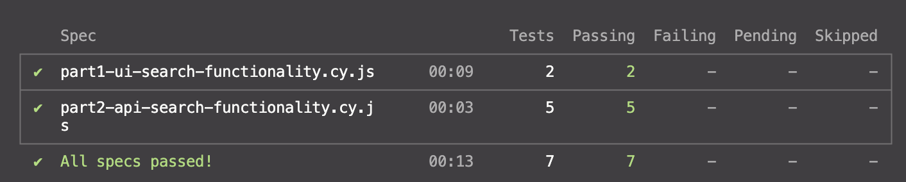
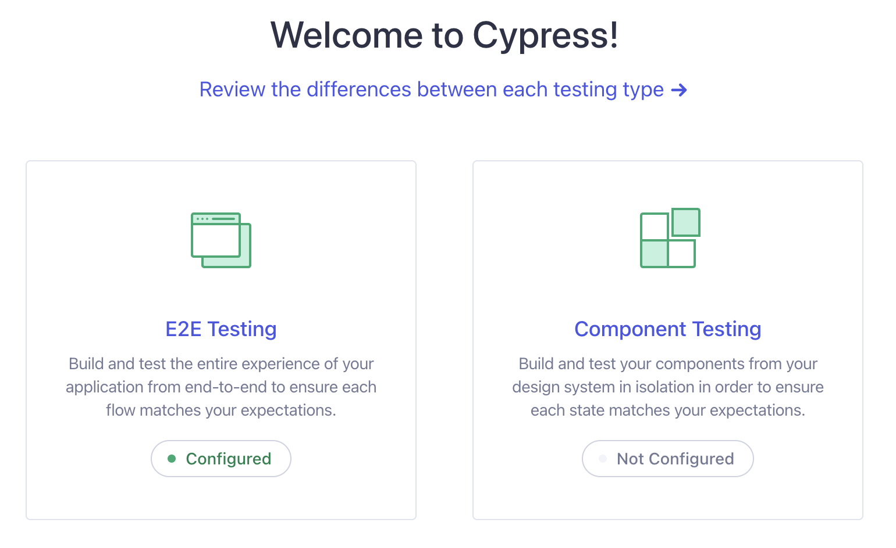
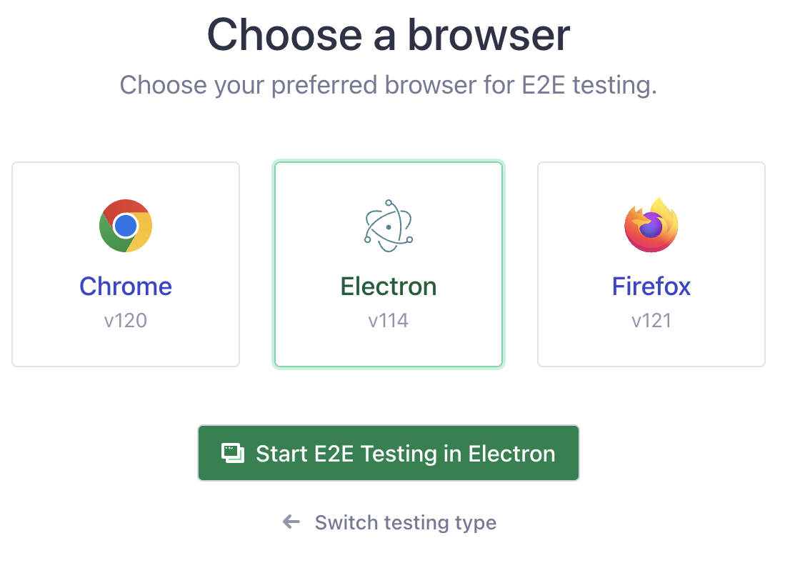
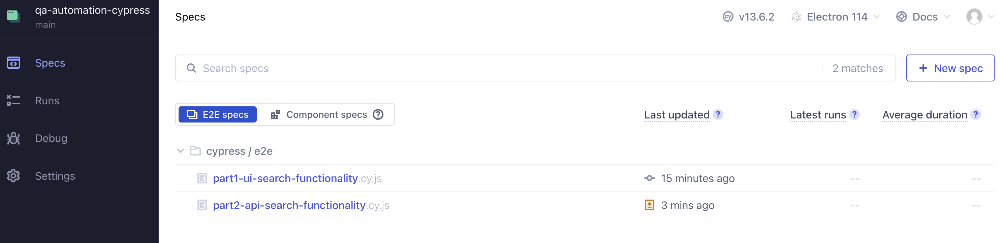
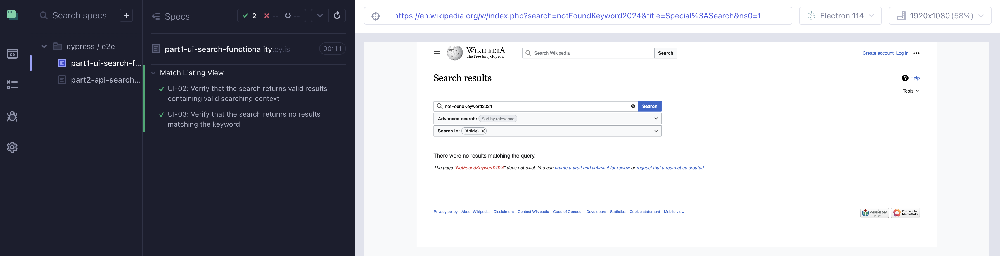
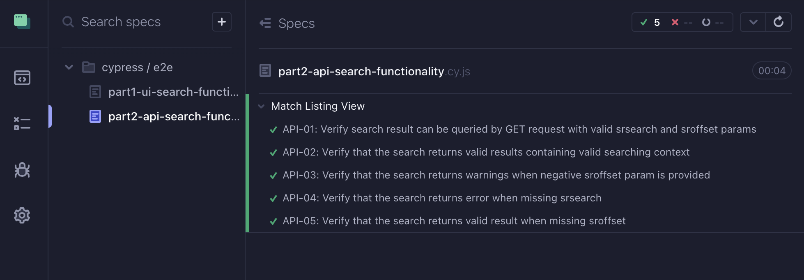

<!-- TABLE OF CONTENTS -->
<h2>
    <details open="open">
        <summary class="normal">Table of Contents</summary>
        <h5>
          <ol>
            <li>
              <a href="#about-the-demo-project">About the demo project</a>
              <ul>
                <li><a href="#built-with">Built With</a>
              </ul>
            </li>
            <li>
              <a href="#getting-started">Getting Started</a>
              <ul>
                <li><a href="#prerequisites">Prerequisites</a>
                <li><a href="#installation">Installation</a>
              </ul>
            </li>
            <li><a href="#usage">Usage</a></li>
            <li><a href="#video-recording">Video Recording</a></li>
          </ol>
        </h5>    
    </details>
</h2>

<!-- ABOUT THE DEMO PROJECT -->

## About the demo project

Cypress Automation Demo - This project is based on Cypress automation framework which enables reliable and robust end-to-end testing for modern web apps (both UI and API).

Top Features:

-   Easy to setup and execute. No extra setup and automatically detect the browsers installed on your machine.
-   Auto-waits for all the relevant checks to pass and only then performs the requested action.
-   UI friendly via Cypress dashboard.
-   Execution of test case is faster when compared with other competitive framework in market.
-   It has ability to produce and visually compare screenshots.

### Built With

-   [Cypress](https://docs.cypress.io/guides/overview/why-cypress)
-   [NodeJS](https://nodejs.org/en)

## Getting Started

### QA Testing Challenges

1. Part 1 - Test Design

Topic: Feature - Search Wikipedia for pages containing specific text (Not including Advance Search)
Submission: Refer to [Part1-UI-Test Design.xlsx](docs/Part1-UI-TestDesign.xlsx)

2. Part 2 - API Automation Test

Topic: Design and automate API test cases in [GET - Wikipedia API](https://en.wikipedia.org/wiki/Special:ApiSandbox#action=query&format=json&list=search&continue=-%7C%7C&formatversion=2&srsearch=Software%20Testing&srnamespace=0&sroffset=10)
Submission: Refer to [Part2-API-TestDesign.xlsx](docs/Part2-API-TestDesign.xlsx)

```JS
cypress/e2e/part2-api-search-functionality.cy.js
```

3. Part 3 - UI Automation Test

Topic: Pick up two UI test cases from your test case design in Part 1 for this challenge.
Submission: _UI-02_ and _UI-03_ are automated cases. Refer the Part 1 document for more details.

```JS
cypress/e2e/part1-ui-search-functionality.cy.js
```

### Prerequisites

The following software is required:

nodejs : Download and Install Node JS from

```sh
https://nodejs.org/en/download/
```

### Installation

1. Clone the repo

```sh
https://github.com/ntviet2409/cypress-automation-demo
```

2. Navigate to folder and install npm packages using:

```sh
npm install
```

## Usage

1. For running test scripts :

```JS
npm run test
```



2. For running test via Cypress dashboard/UI mode:

```JS
npm run ui
```

-   Once Cypress Dashboard is launched > Select E2E Testing
    

-   Select any browser that you prefer to run tests
    

-   Select suites (UI or API suites) to start execution
    

-   Test Result for UI Suites (2 TCs)
    

-   Test Result for API Suites (5 TCs)
    

## Video Recording

Record your automation test run as a proof of successful execution[Video Recording](docs/Recording_Execution_Demo.mov)
